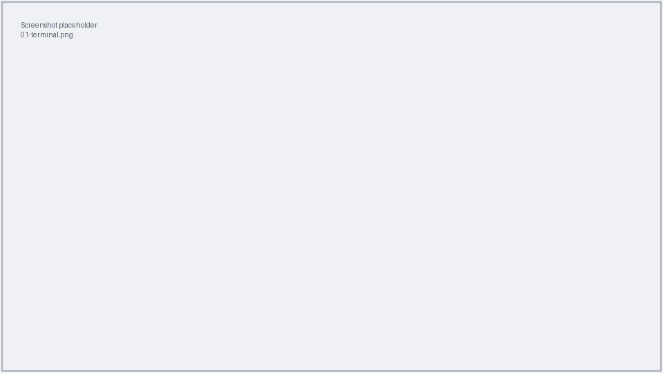
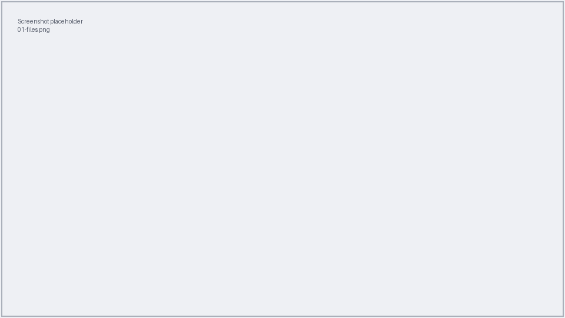
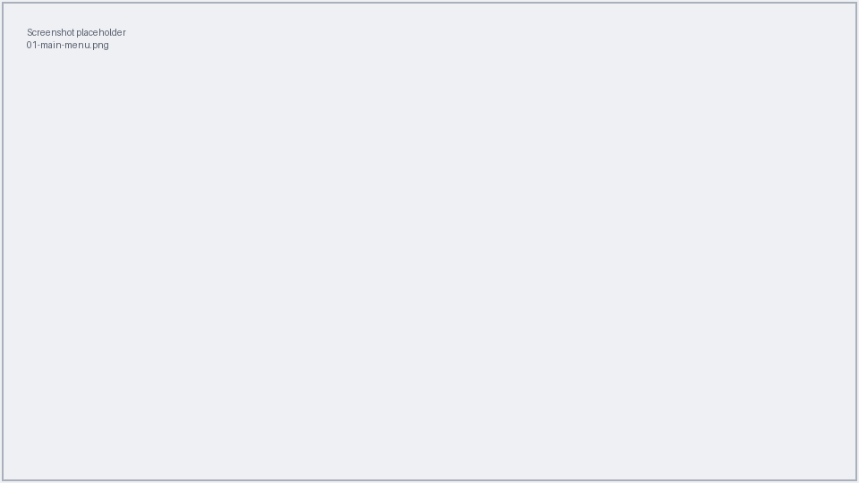
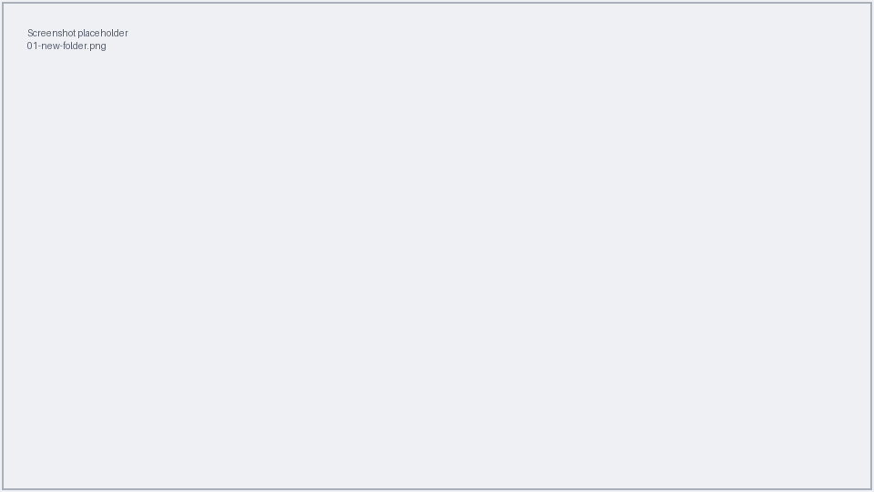
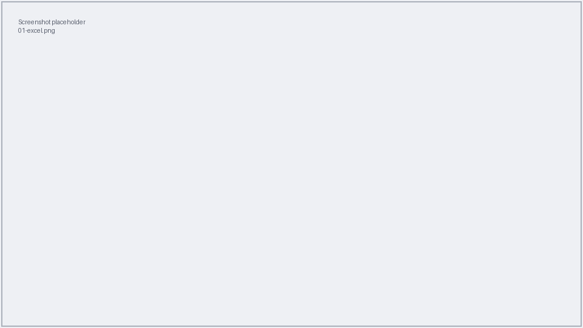
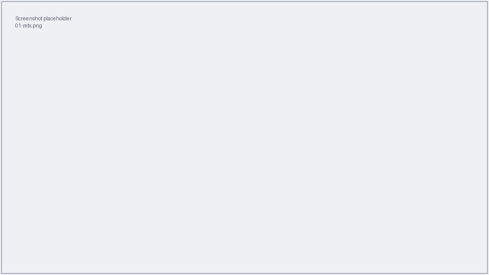

# 1. Prepare your files

This page gets you from a fresh desktop to the guided tool's main menu, and shows
you exactly how your input files must look.

## Open a terminal and the file explorer

You need two things open: a **terminal** (where you type a couple of commands) and
the **file explorer** (where you organise your files).

- **Terminal** — press ++ctrl+alt+t++ (or open *Activities*, type `Terminal`,
  press ++enter++).
- **Files** — click the *Files* icon in the dock (or open *Activities*, type
  `Files`, press ++enter++).

!!! note "Screenshot needed"
    *Figure: the GNOME Terminal window, freshly opened.*



!!! note "Screenshot needed"
    *Figure: the Files (Nautilus) window.*



!!! tip "Two things to know about the terminal"
    - **Copy/paste** uses ++ctrl+shift+c++ and ++ctrl+shift+v++ (the extra
      ++shift++ matters inside a terminal).
    - If a command seems stuck, press ++ctrl+c++ to cancel it. This does not
      break anything.

## Open the guided tool

In the terminal, type these three commands, pressing ++enter++ after each:

```bash
cd ~/Documents/petsurfer-pipeline
source .venv/bin/activate
python run_interactive.py
```

- The first line moves into the project folder. **Your path may be different** —
  ask your administrator where the project lives if the first command reports
  *"No such file or directory"*.
- The second line switches on the tool's environment. You'll see `(.venv)`
  appear at the start of the prompt.
- The third line starts the guided tool.

You should now see the welcome screen and main menu:

!!! note "Screenshot needed"
    *Figure: the PETSurfer welcome panel and the main menu (1 / 2 / 3 / q).*



The menu offers four choices:

| Key | Does |
|-----|------|
| `1` | **Preprocess** patients — [Step 2 of this guide](02-preprocess.md) |
| `2` | **Run group analysis** — [Step 3](03-analyse.md) |
| `3` | **Visualize** results — [Step 4](04-visualize.md) |
| `q` | Quit the tool |

!!! info "Getting back to the menu"
    Press ++ctrl+c++ at any time to cancel the current step and return to this
    menu. Press it **again at the menu** to quit the tool.

## Create your analysis folder

The **analysis folder** is one folder that holds everything for a single analysis:
your patient list, your contrast matrices, and — once you run the analysis — all
the results.

Create it in *Files* with right-click → **New Folder**, and give it a clear name
such as `braak_ad_vs_normal`.

!!! note "Screenshot needed"
    *Figure: creating a new folder in Files via right-click → New Folder.*



!!! tip "Prefer the terminal?"
    You can also create it with one command:

    ```bash
    mkdir ~/Documents/braak_ad_vs_normal
    ```

## The Excel patient list

The patient list is a spreadsheet (`.xlsx`, `.xls`, or `.ods`). **The columns are
read by their position, not their heading**, so the first three columns must be in
this exact order:

| Column | Contents | Example |
|--------|----------|---------|
| 1st | **Include flag** — `1` to process this patient, `0` to skip | `1` |
| 2nd | **Patient ID** (a whole number) | `1042` |
| 3rd | **Timestamp** (which scan session) | `T0` |
| 4th onward | **Group and other variables** | `AD`, `F`, `72` |

For the 4th column onward, the tool figures out the type automatically:

- a column of **words/labels** (e.g. `AD`, `MCI`, `Normal`, or `F`/`M`) becomes a
  **group**;
- a column of **numbers only** (e.g. age) becomes a **continuous variable** used
  as a covariate.

!!! note "Screenshot needed"
    *Figure: a correctly formatted patient list open in a spreadsheet program.*



!!! warning "Common mistakes to avoid"
    - **Do not** add or reorder columns before the group columns — the first three
      columns must stay Include / ID / Timestamp.
    - Keep **only one spreadsheet** in the analysis folder.
    - A patient scanned twice appears on **two rows** (same ID, different
      timestamp); each scan is handled separately.

## The contrast matrix (`.mtx`)

A contrast matrix is a small **plain-text** file describing one comparison. It has
**one contrast per line**, with numbers separated by spaces — for example:

```text
1 -1 0 0
```

Each line must have exactly as many numbers as your design has "regressors". The
number of regressors depends on your groups, your variables, and the design type
(DODS/DOSS). The tool **checks this for you** and tells you if a line has the
wrong number of columns, so you can fix it and re-run.

You can create a `.mtx` file in any plain-text editor (e.g. *Text Editor* /
`gedit`). Save it into the analysis folder with a descriptive name such as
`ad_vs_normal.mtx`.

!!! note "Screenshot needed"
    *Figure: a contrast matrix open in a plain-text editor.*



!!! info "What about the FSGD file?"
    You may have heard of an **FSGD** design file. **You normally don't create
    one** — the tool generates it automatically from your patient list. The exact
    format is documented in the [developer docs](../developers/file-formats.md) if
    you're curious.

## What your analysis folder should contain

Before running the analysis (Step 3), the folder should look like this:

```text
braak_ad_vs_normal/
├── patients.xlsx        ← your patient list (exactly one spreadsheet)
├── ad_vs_normal.mtx     ← one or more contrast matrices
└── ...                  ← results will be written here later
```

!!! note "Screenshot needed"
    *Figure: the analysis folder in Files, containing the spreadsheet and a .mtx.*


You're ready to run the pipeline.

[:octicons-arrow-right-24: Step 2: Preprocess patients](02-preprocess.md)
