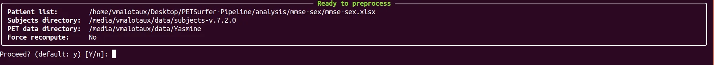
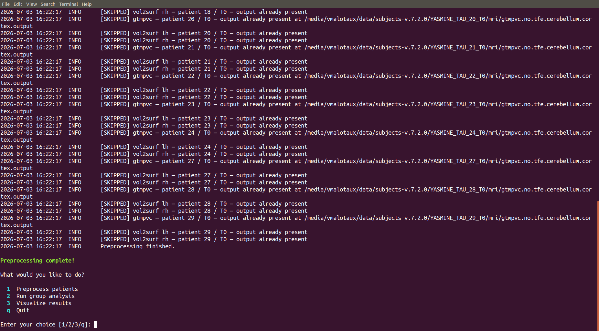

# 2. Preprocess patients

Preprocessing prepares each patient's PET scan for group analysis. Under the hood
it runs two steps for every patient:

1. **Partial volume correction** — corrects the PET signal and calibrates it
   against the cerebellum.
2. **Surface projection** — paints the corrected signal onto a standard 3-D brain
   surface.

You don't need to understand the details — the tool does it for you. This step can
take a while, especially with many patients.

## Running it, screen by screen

From the main menu, press **`1`** and follow the prompts.

The tool asks for the following. Press ++enter++ to accept a default shown in
brackets.

| Prompt | What to enter |
|--------|---------------|
| **Path to the patient list Excel file** | The `.xlsx` in your analysis folder. Start typing and press ++tab++ to auto-complete the path. |
| **Subjects directory** | The folder holding the FreeSurfer subject folders. A sensible default is offered — press ++enter++ unless your admin told you otherwise. |
| **Raw PET data directory** | Where the original PET scans live. Again, accept the default unless told otherwise. |
| **Force recompute?** | Answer `n` (no) normally. Answer `y` only to redo work that's already done. |

The tool then shows a summary panel. Check it, then confirm with `y` to start.

## While it runs, and when it's done

- Patients are processed one at a time. Work that was already finished is
  **skipped automatically** — it is safe to re-run this step to fill in any
  patients that failed the first time.
- When it finishes you'll see **"Preprocessing complete!"**.

## Where the record goes

A log file named `pipeline_<date_time>.log` is saved **next to your Excel file**.
It lists which patients succeeded, were skipped, or failed. If something looks
wrong, see [Troubleshooting](06-troubleshooting.md).

[:octicons-arrow-right-24: Step 3: Run the analysis](03-analyse.md)
