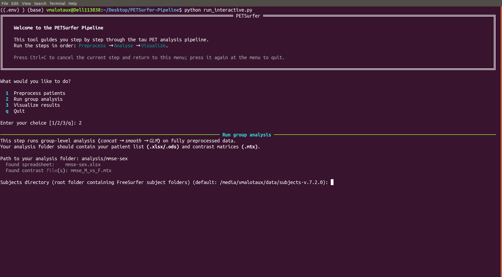
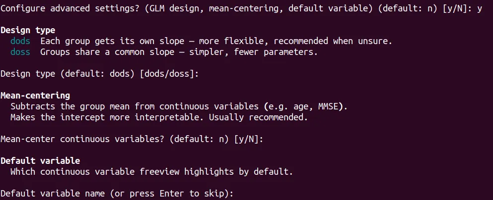
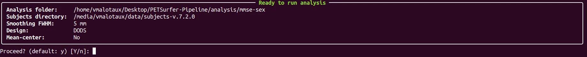

# 3. Run the group analysis

This step compares your groups statistically. It concatenates every patient's
preprocessed data, smooths it, and fits a statistical model (a GLM) using your
patient list and contrast matrices.

!!! warning "Preprocessing must be done first"
    Only patients that were successfully preprocessed (Step 2) can be analysed.

## Running it, screen by screen

From the main menu, press **`2`**.

| Prompt | What to enter |
|--------|---------------|
| **Path to your analysis folder** | The folder you prepared in [Step 1](01-prepare-files.md). It must contain **exactly one** spreadsheet and **at least one** `.mtx`. |
| **Subjects directory** | Accept the default unless told otherwise. |
| **Surface smoothing kernel size (mm)** | How much to smooth the data. `5` is a common default — press ++enter++. |

When you enter the folder, the tool prints what it found, so you can confirm it
picked up the right files:

### Advanced settings (optional)

The tool then asks whether you want to configure advanced settings. Most users
answer **`n`**. If you answer `y`, you can set:

- **Design type** — `dods` (each group gets its own slope; more flexible,
  recommended when unsure) or `doss` (groups share one slope; simpler).
- **Mean-centering** — subtracts the group average from continuous variables like
  age, making the results easier to interpret.
- **Default variable** — which continuous variable the viewer highlights first.

The tool explains each option on screen as it asks.

Finally, review the summary and confirm with `y`.

## What you get

All results are written **into your analysis folder**, including:

- `analysis.fsgd` — the design file the tool generated for you,
- one results folder per hemisphere (containing a sub-folder per contrast),
- `analysis_<date_time>.log` — the record of the run.

When it finishes you'll see **"Analysis complete!"**. You're ready to look at the
results.

[:octicons-arrow-right-24: Step 4: Visualize results](04-visualize.md)
