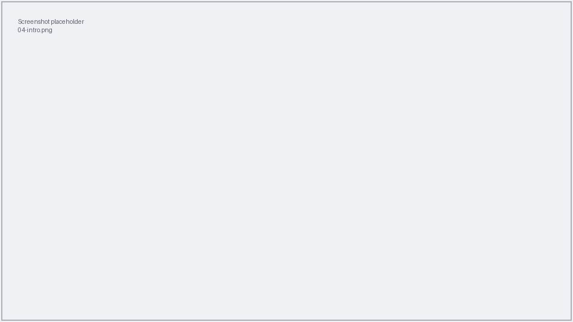
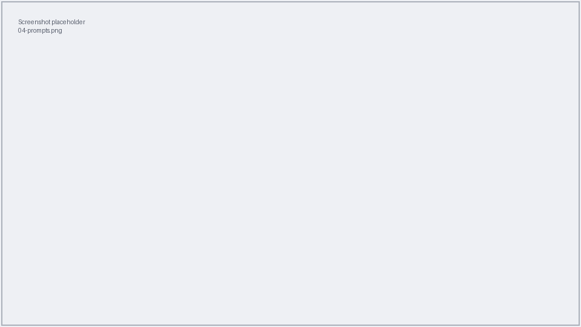

# 4. Visualize results

This step opens your statistical maps in **freeview** (FreeSurfer's 3-D viewer),
overlaid as coloured patches on an inflated brain surface. Bright colours mark
regions where the comparison is statistically strong.

## Running it, screen by screen

From the main menu, press **`3`**.

!!! note "Screenshot needed"
    *Figure: the "Visualize results" intro screen.*

| Prompt | What to enter |
|--------|---------------|
| **Path to your analysis folder** | The same folder you used in [Step 3](03-analyse.md). It must already contain results. |
| **Subjects directory** | Accept the default. It must contain an `fsaverage` folder (it normally does). |
| **Which hemisphere to display?** | `both`, `lh` (left), or `rh` (right). Press ++enter++ for `both`. |
| **Overlay threshold MIN,MAX** | Two numbers, e.g. `2,5`. Values **below MIN** are hidden; values **above MAX** are shown in full colour. |
| **Single contrast to show** | Leave blank to show **all** contrasts, or type one contrast name. |

!!! note "Screenshot needed"
    *Figure: the visualization prompts in the terminal.*

Confirm with `y` to open freeview.

!!! note "Screenshot needed"
    *Figure: the "Ready to visualize" summary panel.*

## Reading the freeview window

freeview opens showing the inflated `fsaverage` brain with your results painted on
top. Coloured regions are where the effect is strongest.

!!! note "Screenshot needed"
    *Figure: freeview showing a significance map on the inflated surface, with the
    overlay layers panel on the left.*

- **Rotate** the brain by dragging with the mouse.
- The **left panel** lists the overlay layers (one per hemisphere/contrast); tick
  and untick them to compare.
- Close the freeview window when you're done to return to the terminal.

!!! tip "The threshold controls what you see"
    If the whole surface looks coloured, raise MIN. If almost nothing shows, lower
    it. You can simply re-run this step with different MIN,MAX values.

[:octicons-arrow-right-24: See a full worked example](05-tutorial.md)
