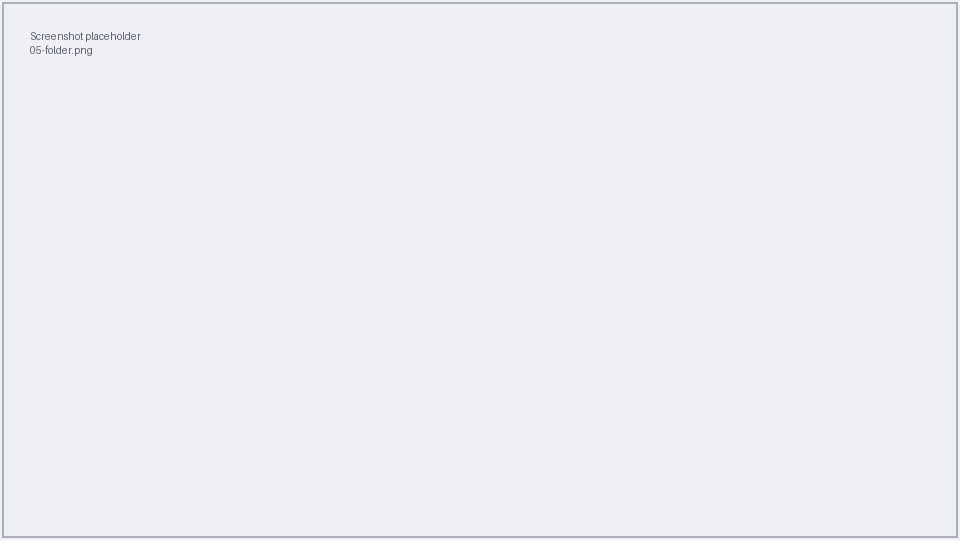
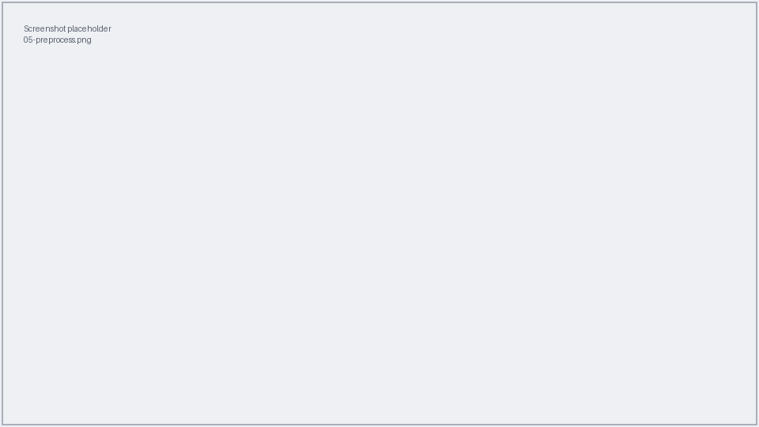

# 5. Full worked example

This page walks through one complete analysis from start to finish, using a tiny
**synthetic** dataset. Nothing here is real patient data — it exists only to show
you the shape of every file and screen.

Our goal: compare **AD** patients against **Normal** controls, adjusting for
**age**.

!!! info "Example files"
    Ready-made copies of these files live in the repository under
    `docs/assets/examples/` (`patients.csv` and `ad_vs_normal.mtx`). Open the CSV
    in a spreadsheet program and save it as `.xlsx`. Their contents are also shown
    inline below, so you can simply retype them.

## Step 0 — Open the tool

Open a terminal and start the guided tool (see
[Prepare your files](01-prepare-files.md) for details):

```bash
cd ~/Documents/petsurfer-pipeline
source .venv/bin/activate
python run_interactive.py
```

## Step 1 — Build the analysis folder

Create a folder for this analysis and put two files in it:

```bash
mkdir ~/Documents/demo_analysis
```

**`patients.xlsx`** — a spreadsheet with these rows (note the two `Normal` and one
`AD` rows are included; the last patient has a `0` in the first column, so they're
skipped):

| Include | PatientID | Timestamp | Group | Sex | Age |
|---------|-----------|-----------|-------|-----|-----|
| 1 | 1001 | T0 | Normal | F | 68 |
| 1 | 1002 | T0 | Normal | M | 71 |
| 1 | 2001 | T0 | MCI | F | 74 |
| 1 | 3001 | T0 | AD | M | 77 |
| 0 | 3002 | T0 | AD | F | 80 |

**`ad_vs_normal.mtx`** — a single contrast (its length must match the design; the
tool checks this for you):

```text
1 0 0 -1 0 0
```

Your folder now contains exactly one spreadsheet and one `.mtx`:

```text
demo_analysis/
├── patients.xlsx
└── ad_vs_normal.mtx
```

!!! note "Screenshot needed"
    *Figure: the demo_analysis folder with the two input files.*



## Step 2 — Preprocess

From the menu, press **`1`**, give the path to `patients.xlsx`, accept the default
directories, answer `n` to force-recompute, and confirm. Wait for
**"Preprocessing complete!"**.

!!! note "Screenshot needed"
    *Figure: preprocessing running for the demo patients.*



Behind the scenes each included patient now has surface-projected PET data ready
for analysis.

## Step 3 — Analyse

From the menu, press **`2`**, give the path to `demo_analysis`, accept the default
subjects directory, keep smoothing at `5`, and answer `n` to advanced settings.
Confirm, and wait for **"Analysis complete!"**.

!!! note "Screenshot needed"
    *Figure: the analysis confirming the found files and finishing.*


Your `demo_analysis` folder now also contains the generated `analysis.fsgd`,
per-hemisphere results folders, and a log file.

## Step 4 — Visualize

From the menu, press **`3`**, give the path to `demo_analysis`, accept the default
subjects directory, choose `both` hemispheres, use threshold `2,5`, and leave the
contrast blank to show everything. Confirm to open freeview.

!!! note "Screenshot needed"
    *Figure: the demo result shown in freeview.*


That's a complete run. When you use your own data, the only things that change are
the patient list and the contrasts — the steps are identical.

[:octicons-arrow-right-24: Troubleshooting](06-troubleshooting.md)
